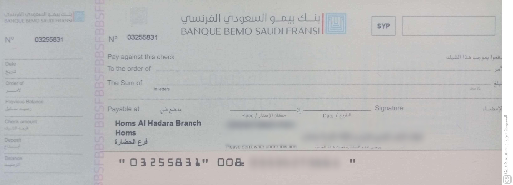
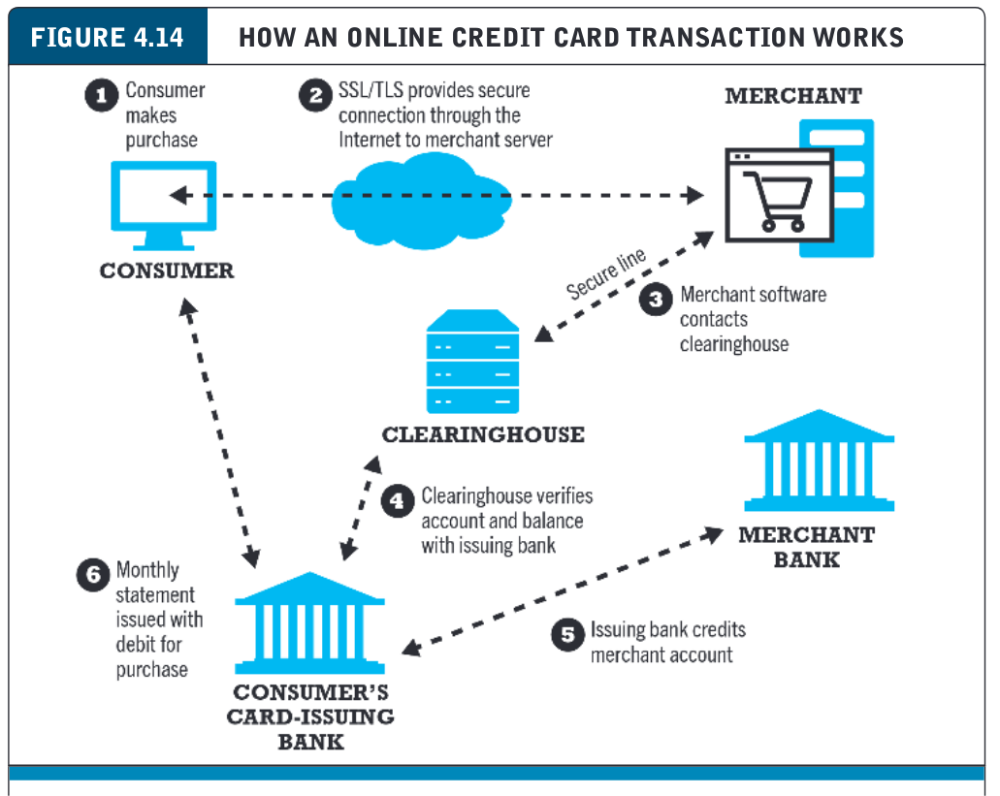
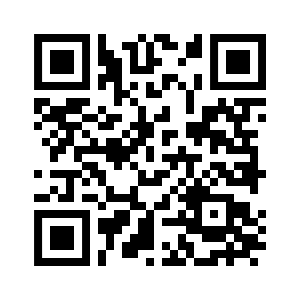
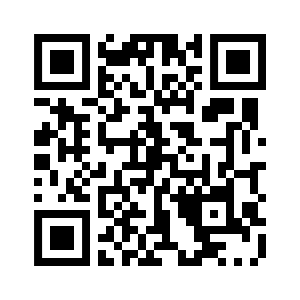

# المحاضرة 3
## التجارة الإلكترونية
### الدفع الإلكتروني


### العام الدراسي 2025-2026
### الفصل الثاني
---

```yaml
hideInToc: true
```
# في الحلقة السابقة
- مفاهيم التسويق الإلكتروني
- أهمية الموقع الإلكتروني
- التسويق الاجتماعي
- الجانب المظلم لوسائل التواصل الاجتماعي
---

```yaml
hideInToc: true
```
# الفهرس
<Toc mindepth="1" maxdepth="2"/>

---

# البنوك
## أهمية البنوك في العجلة الاقتصادية
- للبنك (المصرف) أهمية كبيرة في إدارة العجلة الاقتصادية في أي بلد
- لا يقتصر دور البنك على إيداع وسحب الأموال
- إنما هو الضامن والحيادي في المناقلات المالية
	- بمعنى آخر إذا كان لديك دفع مبلغ كبير، لا يعتبر الدفع النقدي (كاش) حلًا مناسبًا
	- بهذه الحالة نلجأ لتحويل بنكي من حساب لآخر ضمن نفس البنك أو ضمن بنكين مختلفين
	- يضمن البنك أو البنوك تنفيذ العملية بشكل قانوني ونظامي ومؤكد
	- في حال أردت إدخال أو إخراج مبالغ مالية كبيرة من البلاد لا يمكنك فعل ذلك في حقيبة (جرم تهريب عملة) يتم عن طريق تحويل مالي بنكي بين بنكين في دولتين مختلفتين (إما عن طريق نظام SWIFT الأمريكي أو  CIPS الصيني أو غيرها)
--- 

```yaml
hideInToc: true
```
# البنوك
## البنك الإلكتروني
- عندما يسمح لك البنك التقليدي بإجراء العمليات المالية المختلفة عبر الإنترنت يصبح بنكًا إلكترونيًا
- قد يكون بنك افتراضي يعمل حصرًا عبر الإنترنت أو بوابة خِدْمَات إلكترونية لبنوك تقليدية
- بأي شكلٍ من الأشكال يجب أن يسمح بـ:
	- تحويل مبالغ مالية من وإلى حساب ما
	- التحقق من الرصيد
	- دفع فواتير، ثمن مواد، ثمن خِدْمَات ... الخ
---

# آليات دفع عن بعد
## الشيكات
- الشيك هو عبارة عن وثيقة خاصة صادرة من صاحب حساب بنكي لشخص ما، تتضمن أمرًا للبنك بدفع المبلغ المالي المذكور ضمنه إلى الشخص المذكور
- لتنفيذ الشيك، يأخذ المتلقي هذه الورقة ويتجه إلى بنك صاحب الشيك
- يسلمهم الشيك ويستلم النقود
- يطبع الشيك على ورق خاص متضمنًا مزايا أمنية منعًا للتزوير

---

```yaml
hideInToc: true
```
# آليات دفع عن بعد
## البطاقات
- بطاقات بلاستيكية تتضمن شريطًا ممغنطًا (النسخ القديمة) أو شريحة SIM/NFC بالنسخ الحديثة
- تسمح لنا بتنفيذ عملية الدفع بدون أي مناقلة نقدية
- لها ثلاثة أنواع مميزة
	- Credite
	- Debit
	- Charge
---

```yaml
hideInToc: true
```
# آليات دفع عن بعد
## البطاقات
<div grid="~ gap-1 cols-3" >
<div>

### Credite
- تتضمن رصيد مالي يمكن الإنفاق منه لتدبير المصاريف اليومية
- عبارة عن قرض مستمر
- يقوم البنك أو الشركة المصدرة للبطاقة بإقراض الزبون مال لتنفيذ عمليات الشراء على أن يقوم برد  المبلغ بعد فترة
- إذا تأخر في السداد تتراكم فائدة
</div>
<div>

### Debit
- تعمل على تحويل أو دفع مبلغ مالي من حساب الزبون لحساب التاجر
- لا تعمل على إقراض الزبون وإنما تستوجب تواجد القيمة المالية ضمن الحساب
- أي أنها تقوم بخصم المبلغ من الحساب الشخصي للزبون
- هي نفسها بطاقة الصراف المتعارف عليها في سورية
</div>
<div>

### Charge

- مشابهة لبطاقة الائتمان
- يتطلب من الزبون دفع المبلغ المقترض مع نهاية الشهر
- لا توجد فائدة، بالمقابل رسومها السنوية أعلى
</div>
</div>
---

```yaml
hideInToc: true
```
# آليات دفع عن بعد
## البطاقات
- النموذج الأكثر شيوعًا هو بطاقة الائتمان
- الشركتان الأكبر في هذا المجال
	- Visa
	- Mastercard
- تتميز بمستوى أمان سيء جدًا
	- هي سهلة السرقة
	- تم ابتكار هذه البطاقات في الستينيات، وما زالت تعتمد على أساليب حماية ضعيفة
	- الرمز الرباعي (PIN) محدود القيم (10000 قيمة فقط) سهل التخمين بالاعتماد على الحواسيب الحالية
	- القيود الأمنية الموجودة عليها (مثل التوقيع على إيصال البطاقة) غالباً لا ينتج عنها شيء
---

```yaml
hideInToc: true
```
# آليات دفع عن بعد
## البطاقات
- مشاكل بطاقات الائتمان
	- التحقق من الهوية
	- تكاليف التشغيل من جهة البائع تعتبر عالية
	- الحصول على البطاقة قد يكون سهلًا أو صعبًا بناءً على معايير خاصة بالشركات المصدرة للبطاقات
---

```yaml
hideInToc: true
```
# آليات دفع عن بعد
## البطاقات
### آلية معالجة طلب الدفع في بطاقة الائتمان


---

```yaml
hideInToc: true
```
# آليات دفع عن بعد
## البوابة الإلكترونية
- يجب تواجد بوابة إلكترونية تمكن المؤسسات المالية من معالجة طلبات الدفع عن طريق بطاقات الائتمان
--- 

# تنظيم عملية الدفع
## معيار PCI-DSS
- PCI-DSS (Payment Card Industry-Data Security Standard)
- معيار لتأمين عمليات الدفع الإلكتروني
- لم يصدر عن طريق جهة حكومية وإنما عن طريق اجتماع مجموعة من شركات إصدار بطاقات الائتمان
- اتفقت هذه الشركات على هذا المعيار
- يحتوي‬ ‫‪PCI-DSS‬‬ ‫على‬‫ مستويات‬ ‫مختلفة (1-4)‬ ‫‪،‬‬ تتعلق بحجم المناقلات المالية
- يهدف إلى:
- إنشاء‬ ‫شبكة‬ ‫آمنة‬ ‫وصيانتها‬
- حماية‬ ‫بيانات‬ ‫حامل‬ ‫البطاقة‬
- الحفاظ ‫على‬ ‫برنامَج‬ ‫إدارة‬ ‫الثغرات‬ ‫الأمنية
- ‫تنفيذ‬ ‫تدابير‬ ‫قوية‬ ‫لمراقبة‬ ‫الدخول‬
- ‪اختبار‬ ‫الشبكات‬ ‫ومراقبتها‬ ‫بانتظام‬
- الحفاظ‬ ‫على‬ ‫سياسة‬ ‫أمن‬ ‫المعلومات‬ ‫
---

# البطاقات الوهمية
- من أكثر المشاكل التي يعاني منها المستخدمون خصوصًا مع الخِدْمَات الإلكترونية هي صعوبة الإلغاء
- مثلًا:
	- شركة الصالات الرباضية Planet Fitness تتطلب سند إقامة أنك لإثبات انتقالك من سكن لأخر لإغلاق حسابك، على الرغم من أن عملية فتح الحساب سهلة جدًا
	- شركة Adobe تمتلك شروط غريبة عجيبة لإنهاء الاشتراك تتضمن التخلي عن دفع بقية الشهر حتى لو أنهيت الاشتراك أول يوم في الشهر
- نتيجة هذه السلوكيات الغريبة العجيبة ظهرت شركات تسمح لك بإنشاء بطاقات وهمية برصيد محدد (50$ مثلًا)
	- يمكنك استخدامها عند التسجيل في إحدى هذه الخدمات
	- في حال انتهاء الرصيد يتم غلق الحساب تلقائيًا لعدم الدفع
--- 

# Paypal
- هي عبارة عن مصنة للتبادل المالي (بسقف محدد لكل عملية)
- لا تتطلب سوى وجود بريد إلكتروني وحساب بنكي أو بطاقات دين/ائتمان
- online stored value payment system
- تقوم بربط حساب PayPal بحساب بنكي أو بطاقة ائتمان بحساب PayPal
- تتولى المنصة نقل المبلغ المالي من المشتري للبائع
- أكثر أمناً
- أكثر كلفة
- بدائل
	- Amazon Pay
	- Dwolla
---

# المحافظ الإلكترونية
- هي عبارة عن تطبيقات تعمل على الجوال مثل
	- Apple Pay
	- Google Pay
	- Samsung Pay
- تعمل على تخزين معلومات مالية مثل
	- أرقام البطاقات
	- حسابات بنكية
	- فواتير
	- كوبونات
- تسهل عملية إدارة البطاقات المختلفة
--- 

```yaml
hideInToc: true
```
# المحافظ الإلكترونية
- لها أنواع عدة أشهرها :
<div grid="~ cols-3 gap-1">
<div>

## Universal proximity mobile wallet
- يمكن أن تستخدم لأي عملية تسديد مالية شريطة أن يمتلك التاجر حساب تاجر ليقبل عملية التحويل المالي
</div>
<div>

## Branded store proximity mobile wallets
- تسمح بالشراء فقط ضمن متجر أو سلسلة متاجر محددة
</div>
<div>

## P2P mobile payment apps
- تسمح بعمليات التحويل المالي بين الأفراد مثل Venmo
</div>
</div>
---

# العملات الرقمية
## لمحة تاريخية
- تظهر جذور العملات الرقمية مع الانهيار المالي الذي حصل عام 2008
- نتيجة طريقة تعامل الحكومات مع سلوك البنوك الذي سبب هذه الأزمة، قام ساتوشي ناكامورا بتطوير أول عملة رقمية BitCoin
- القصة طويلة، إنما الملخص كما يلي:
	- تعتمد البنوك بعلمها على القروض بشكل أساسي، وبالتالي لجأت لتقييم المقترضين وفق نظام محدد
	- مع ازدهار الاقتصاد الأمريكي في الفترة التي تلت 9-11-2001 نتيجة التخفيض القصري لمعدل الفائدة في الولايات المتحددة لدفع عجلة الاقتصاد
	- ازدادت عمليات الاقتراض، وبالتالي ظهرت شركات تتعامل مع البنوك هدفها من الوجود تقييم المقترضين
	- العديد من المقترضين ذوي التصنيف الحقيقي الخطر (أي احتمال عدم قدرته على تسديد القرض كبير) تم تصنيفهم على أنهم آمنين (لزيادة أرباح هذه الشركات المتخصصة في تقييم المقترضين)
---

```yaml
hideInToc: true
```
# العملات الرقمية
## لمحة تاريخية
- مع ظهور شبح تضخم كبير في الأفق عمد الفيدرالي الأمريكي إلى رفع سعر الفائدة لكبح جماح الإنفاق المالي
- مما دفع البنوك لرفع فوائد القروض التي هي قيد التسديد
- مما تسبب في عدم قدرة المقترضين الخطرين على تسديد قروضهم
- مما تسبب في نقص السيولة المالية لدى البنوك
- وبالتالي انهيار القطاع المصرفي الأمريكي
- لتجنب انهيار الاقتصاد الأمريكي عملت الحكومة الأمريكية والفيدرالي الأمريكي على ضخ مليارات الدولارات من السيولة للبنوك للمحافظة على عملها (بعض منها لم يتلقى أي مساعدة من الحكومة الأمريكية والفيدرالي مما أدى لإفلاسها)
- لتعود البنك لسولكها السابق دون أي محاسبة من الحكومة الأمريكية لمن تسبب في هذه الانهيارات على الرغم من خرق عدد لا بأس به من القوانين
- وكأنك يابو زيد ما غزيت
---

```yaml
hideInToc: true
```
# العملات الرقمية
## لمحة تاريخية
- هذا ما دفع مبرمج مجهول الهوية يدعى ساتوشي ناكمورا إلى بناء أول عملة رقمية bitcoin
- مستقلة عن الحكومة وبالتالي لا تتأثر بقراراتها
- لا مركزية لا يمكن السيطرة عليها
- توفر مقدار هائل من الخصوصية إذ لا يمكن التعرف على أطراف عملية الدفع
- تتميز عملة BitCoin بما يلي:
	- اللامركزية  (بفعل blockchain)
	- المحدودية (21 مليون بتكوين)
--- 

```yaml
hideInToc: true
```
# العملات الرقمية
## مفهوم Blockchain
- عبارة عن تقنية تشفير تعتمد على تجزئة البيانات لمجموعة من الكتل الموزعة في أماكن مختلفة- 
- تستخدم لتخزين البيانات المختلفة والتحقق من صحتها
- تعمل الـ BitCoin على تخزين المناقلات ضمن سجل Ledger محمي باستخدام Block Chain
- هذا ما يسمح بحماية المعلومات
- بالإضافة لذلك توفر BitCoin تشفير كامل لأطراف المناقلة عن طريق تمثيل كل منهم برمز معقد
- هذا ما يسمح بإجراء عمليات بيع وشراء دون معرفة من البائع ومن المشتري (عماد النظام المالي التقليدي)
- نظراً لطبيعة المناقلات المجهولة باستخدام BitCoin يتم استخدامها بكثرة في العمليات الغير قانونية
	- Silk Road
---

```yaml
hideInToc: true
```
# العملات الرقمية
## التنقيب في Bitcoin
- تعد عملية التنقيب الوسيلة لتأمين الشبكة والتحقق من المعاملات عن طريق حل ألغاز رياضية معقدة باستخدام أجهزة كمبيوتر متخصصة تُعرف بـ (ASICs). 
- يتنافس المعدّنون لإيجاد حل تشفيري، ويقوم الفائز بإضافة كتلة جديدة إلى Ledger، مما يمنحه مكافآت من Bitcoin ورسوم المعاملات، وهي عملية تحول الكهرباء بشكل أساسي إلى أمن رقمي.
- كيفية عمل تعدين البيتكوين:
	- **معالجة المعاملات:** يقوم المنقبون بجمع معاملات Bitcoin المعلقة في "كتلة" ليتم معالجتها.
	- **اللغز (إثبات العمل):** لإضافة هذه الكتلة، يجب على المعدّنين العثور على hash محدد، وهو عبارة عن سلسلة أبجدية رقمية مكونة من 64 حرفاً تستوفي معايير صارمة.
	- **التجربة والخطأ (التجزئة):** تقوم أجهزة الكمبيوتر بحساب ملايين التخمينات العشوائية (nonces) في الثانية، وتمريرها عبر خوارزمية SHA-256 حتى يتم العثور على التطابق المطلوب.
--- 

```yaml
hideInToc: true
```
# العملات الرقمية
## التنقيب في Bitcoin
- كيفية عمل تعدين البيتكوين:
	- **إضافة الكتلة:** يقوم أول معدّن يعثر على Hash الصحيح ببثه إلى الشبكة، والتحقق منه مع الآخرين، ومن ثم إضافة الكتلة بشكل دائم إلى السجل اللامركزي Ledger.
	- **المكافآت:** يتم مكافأة المعدّن الفائز بعملات بيتكوين تم إنشاؤها حديثاً (مكافأة الكتلة) بالإضافة إلى رسوم المعاملات

---

```yaml
hideInToc: true
```
# العملات الرقمية
## التنقيب في Bitcoin
- بعد ظهور الـ Bitcoin ظهر كم كبير من العملات الرقمية مثل  Ethereum و Doge
- كما ظهرت شركات متخصصة في العملات الرقمية
- إلا أن الإدارة السيئة لها وعدم تواجد منتج فعلي لها دفعها للإنهيار بسرعة كقصة Sam Bankman Fried
---

# حباشات مساعدة للدفع الإلكتروني
## منصة Stripe
- تخيل تريد تطوير تطبيق تجارة إلكترونية
- مطلوب منك دعم الدفع بعدة تقنيات
	- Paypal
	- Visa/Master
	- Bitcoin
- تم تطوير منصة Stripe لدعم واجهة موحدة لعملية الدفع الإلكتروني بشكل بسيط ويزيح كاهل الالتزام بمعيار PCI-DSS من على عاتقك
- تدعم هذه المنصة أكثر من 135 عملة و100 طريقة دفع عالمية بما في ذلك Paypal وبطاقات الائتمان والدفع بالعملات المشفرة (BTC, Ether, USDC) عن طريق تحويلها للعملة الافتراضية للتاجر مباشرةً
---

```yaml
hideInToc: true
```
# حباشات مساعدة للدفع الإلكتروني
## NFC
- Near field communication
- عبارة عن تقنيات تعتمد على موجات راديوية ضعيفة جدًا تسمح بمشاركة المعلومات بين جهازين شريطة ألا يتجاوز البعد بينهما أكثر من 5 سم
- هذه الأجهزة إما إيجابية أو سلبية، الإيجابية تمتلك مصدر طاقة خاص بها، أما السلبية فتعتمد على موجات الراديو الواصلة إليها لتعمل
- هي نظام تواصل P2P ند للند قائم على نقل البيانات والمعلومات لا سلكياً ضمن مدى قصير جداً لا يتعدى السنتميترات بين جهازين 
- نحتاج إلى جهاز إيجابي (مزود بالكهرباء) على الأقل مثل هاتف خليوي، ويمكن أن يكون الطرف الثاني إيجابياً أو سلبياً (الجهاز السلبي يتحصل على كهربائه من الأمواج الكهرطيسية للجهاز الإيجابي) مثل قارئ NFC المتواجد لدى البائعين
---

```yaml
hideInToc: true
```
# حباشات مساعدة للدفع الإلكتروني
## NFC
- يحتاج لمعدات خاصة للقراءة والكتابة
	- يمكن استخدامه للتسديد المالي (مثلاً جهاز محاسبة يحتوي شريحة NFC يتم تعديلها بشكل مستمر لتتضمن قيمة الفاتورة)
	- يمكن أن يستخدم أيضاً للترويج (يتم تصنيع بطاقات بلاستيكية بحجم بطاقات الأعمال تحتوي على دارة NFC بداخلها ويتم الكتابة على البطاقة بطابعات خاصة)
	- البحث عن الموجودات (في المستودعات الكبيرة يمكن استخدام تجهيزات NFC لتميز الصناديق المختلفة بحيث يمكن قراءة معلومات الصندوق من خلالها)
- لكل جهاز NFC قدرة تخزين محدودة (ضمن مئات البايتات)
- يتم كتابة المعلومات الأساسية ضمنها
	- مثلاً: معرف البضاعة، السعر
- يمكن قرائتها من أجهزة خاصة أو من أجهزة الموبايل
---

```yaml
hideInToc: true
```
# حباشات مساعدة للدفع الإلكتروني
## QR Code
- هو شكل من أشكال الـ Bar Code
- صمم بشكل خاص يسمح بقرائته من خلال الكاميرا على خلاف الـ Bar Code التقليدي الذي يحتاج لقارئ خاص
- يمكن أن يحتوي على كم كبير من المعلومات إذ يعمل على ترميز نص ضمن الباركود
- يمكن استخدامه بنفس طريقة استخدام NFC ويعتبر ذو تكلفة أقل نظراً لأننا نحتاج فقط لطباعته على ورق عادي ولا يتطلب تجيهزات خاصة للقراءة (فقط كاميرا) والكتابة (فقط طابعة أو شاشة)
---

```yaml
hideInToc: true
```
# حباشات مساعدة للدفع الإلكتروني
## QR Code
<div grid="~ cols-2 gap-4">
<div>

</div>
<div>

- يمكن أن يحوي روابط
- عناوين
- بطاقات vCard (جهة اتصال)
- معلومات منتج
- تفاصيل تحويل مالي (كما في تطبيق سيرياتل كاش)
- كما يتقبل تواجد أيقونة في وسطه تتضمن شعار الشركة
</div>
</div>
---

```yaml
hideInToc: true
```
# حباشات مساعدة للدفع الإلكتروني
## QR Code
<div grid="~ cols-2 gap-4">
<div>

</div>
<div>

- عمدت العديد من الجامعات حول العالم لاستخدامه لتسجيل حضور الطلاب
- يتم توليد QR Code خاص بكل محاضرة لكل مادة بكل يوم بشكل مستقل عن غيرها
- على الطالب كي يثبت حضوره أن يقوم بإجراء مسح Scan عن طريق كاميرا الموبايل لهذا QR Code من خلال تطبيق الجامعة الخاص ليتم تسجيل الحضور
</div>
</div>