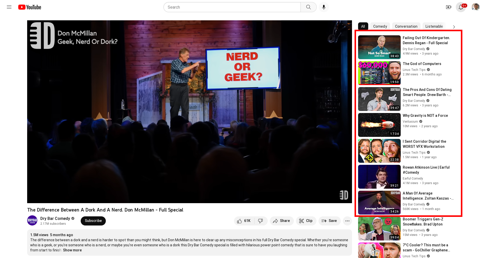
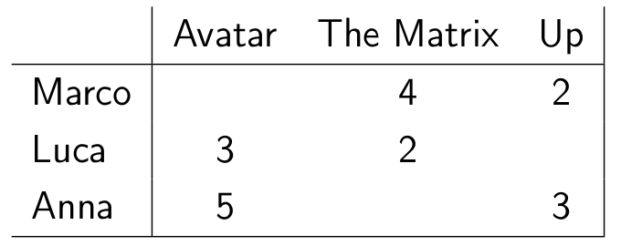
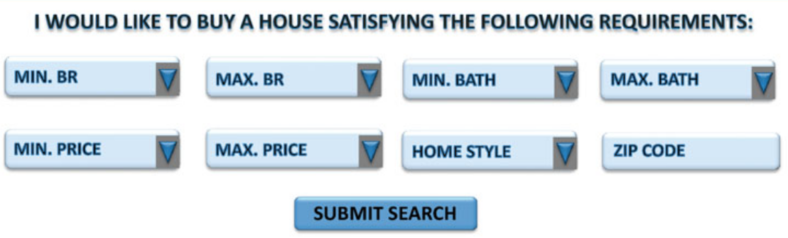

# المحاضرة 4
## االنظم الناصحة


### العام الدراسي 2025-2026
### الفصل الثاني
---

```yaml
hideInToc: true
```
# في الحلقة السابقة
 - الدفع الإلكتروني
 - ماهي Stripe
 - NFC + QR Code
 - ما قصة الـ Bitcoin
---

```yaml
hideInToc: true
```
# الفهرس
<Toc mindepth="1" maxdepth="2"/>

---

```yaml
hideInToc: true
```
# سؤال فني
- كيف يحدد الـ Youtube ما هي المقاطع التي تحب أن تشاهدها

---

# تعريف النظم الناصحة
- النظم الناصحة هي نوع خاص من النظم التي تعمل على توفير توصيات مخصصة بناءً على توصيف المستخدم لمحتوى هو يهتم به
- متابع كرة قدم يتوفر له مقاطع فيديو عن كرة القدم وليس سباق السيارات
- تقديم توصيات لشراء منتجات بناءً على سلوك المستخدم والمنتجات التي قام بشرائها مسبقاً
- يرفع هذا من احتمال شراء المستخدم لمنتجات إضافية
---

```yaml
hdieInToc: true
```
# تعريف النظم الناصحة
## أهداف النظم الناصحة
- الصلة: الهدف الأكثر وضوحاً هو التوصية بالعناصر ذات الصلة بالمستخدم في متناول اليد
- الحداثة: تعد أنظمة النصح مفيدة عندما يكون العنصر الموصى به شيئًا لم يراه المستخدم في الماضي.
- الصدفة: حيث تكون العناصر الموصى بها غير متوقعة إلى حد ما ، وبالتالي هناك عنصر متواضع لاكتشاف الحظ.
- زيادة التنوع: تقدم النظم الناصحة عادةً قائمة بأفضل k عنصر مناسب، إذا كانت هذه العناصر مختلفة تقل احتمالية أن يقوم بالمستخدم بتجاهلها.
---

# أنواع النظم الناصحة
- التصفية التعاونية
- القائم على المحتوى
- القائم على المعرفة
- القائم على الديموغرافية
- الهجين
---

```yaml
hideInToc: true
```
# أنواع النظم الناصحة
## التصفية التعاونية
- Collaborative Filtering
- تعتمد بشكل أساسلي على تقيمات المستخدمين للمنتجات
- التحدي الأساسي هو بناء مصفوفة تقيمات واسعة Sparse
- يتم بناء المصفوفة بالاعتماد على التقييمات التي قام بها المستخدمون وهي التقيمات الملحوظة Observed
- يتم استنتاج بقية القيم من القيم الملحوظة نظراً لوجود ترابط عال بينها
---

```yaml
hideInToc: true
```
# أنواع النظم الناصحة
## التصفية التعاونية
<div grid="~ cols-2 gap -1">
<div>

- في الجدول المجاور لدينا 3 مستخدمين و3 أفلام
	- نلاحظ أن كل من Luca وAnna أعطيا فيلم Avatar تقييمًا إيجابيًا، وبما أن Anna أعطت فليم Up تقييمًا إيجابيًا فمن المتوقع أن يعجب Luca لذلك يتم اقتراح فلم Up له
	- نلاحظ أن Marco لم يعجبه فلم Up بينما أعحبه فلم The Matrix ولأن Anna أعجبت بـ Up فلن يتم اقتراح فلم The Matrix لها
- من المشاكل الأساسية التي يعاني منها هذا النوع، مشكلة أول مرة، بمعنىً آخر عند افتتاح الموقع أول مرة لن يكون هنالك أي تعليقات أو تقييمات
</div>
<div>

</div>
</div>
---

```yaml
hideInToc: true
```
# أنواع النظم الناصحة
## التصفية التعاونية
### أنواعها
- الذاكرة:
	- طرق يشار إليها أيضًا باسم خوارزميات التصفية التعاونية القائمة على الجوار. كانت هذه من بين أقدم الخوارزميات، حيث يتم التنبؤ بتصنيفات مجموعات عناصر المستخدم على أساس الجوار. يمكن تعريف هذا الجوار بإحدى طريقتين:
		- القائمة على المستخدم: يتم فيها الحصول على التوصيات من مستخدمين مشابهين للمستخدم الهدف
		- القائمة على المنتج: يتم فيها الحصول على التوصيات بناءً على المنتجات المشابهة للمنتجات التي تم تحديدها من قبل المستخدم
- الذكية: تعتمد على خوازرميات تعلم الآلة والتنقيب في البيانات لتقديم التوصيات
---

```yaml
hideInToc: true
```
# أنواع النظم الناصحة
## القائمة على المحتوى
- تعتمد في التوصيات على توصيف المنتجات
- بناءً على المنتجات التي اختارها المستخدم، تقوم بدراسة مواصفات هذه المنتجات وتقدم توصيات لمنتجات تشابها في المواصفات
- أي مثلًا يتم اقتراح الحواسيب بناءً على مواصفاتها وما يناسبك عوضاً عن تقييمات المستخدمين والزبائن
## القائمة على المعرفة
- مفيدة في حالة المنتجات التي لا يتم شراءها بكثرة
- الخدمات المالية، المنتجات الفاخرة وأي منتجات قابلة لتخصيص
- لا تعتمد على التقيمات
- وإنما تعتمد على درجة التقارب بين احتياجات المستخدم ومواصفات المنتجات

---

```yaml
hideInToc: true
```
# أنواع النظم الناصحة
## القائمة على المعرفة
 
 
---

```yaml
hideInToc: true
```
# أنواع النظم الناصحة
## القائم على الديموغرافية
- تعتمد وبشكل كبير على المعلومات الديموغرافية للمستخدم
- مكان السكن، العمر، الجنس، البلد، مستوى الدخل، .... الخ
- تعمل على مبدأ أن الناس الذين ينتمون لنفس المجموعة الديموغرافية لهم نفس الذوق في المنتجات أو احتياجات متشابهة
## الهجين
- كل نوع من الأنواع السابقة مفيد في عدد محدود من الحالات
- لتعميم النتائج وزيادة فرص النجاح يتم اعتماد نموذج هجين
- هذا النموذج قادر على استخدام أكثر من طريقة أو خوارزمية لتوفير التوصيات المناسبة
- على مبدأ أخذ أكثر من وجهة نظر في نفس الموضوع
---

# خوارزمية TikTok
- يعدّهذا التطبيق ممثالًامممتازًالدراسة جودة النظم الناصحة
- لا يتطلب التطبيق من المستخدم سوى كمية قليلة ججدًامن المعلومات على خلاف Facebook
- ككلّماأمضيت ووقتًاأكثر على البرنامج، تمكن من تعلم تفاصيل أكثر عنك
- عن طريق مراقبة الفيديوهات التي تشاهدها
- وبناءً على ذلك يقوم بالتوصية بفيديوهات مشابهة
- المخاطر
- في حال شاهدت فيديو عن الاكتئاب => ينصح بفيديوهات عن الاكتئاب مما يزيد الاكتئاب => قد يزيد من احتمال الأذية الذاتية أو حتى الانتحار
---

# خوارزمية Instagram
- نلاحظ خضوع تطبيق Instagram لملاحقات وتحقيقات قانونية من الحكومة الأمريكية
- السبب الرئيسي يعود لكيفية عمل هذا التطبيق
- تأسس Instagram لمشاركة الصور، وتتطور لاحقًا ليشمل الفيديو
- الجمهور الرئيسي الذي يؤثر عليه التطبيق هم المراهقين
- يعتبر الإنسان في هذه المرحلة أكثر تأثرًا بالقضايا المختلفة إذ أنها مرحلة تشكيل الوعي الشخصي له
- مع الضغوط الاجتماعية على المراهقين وخصوصًا الفتيات منهم، تأثرن بشكل كبير بـ "المؤثرات" المتخصصات باللياقة البدنية
- المشكلة تكمن في معرفة الشركة الأم ميتا لهذه التفاصيل وعدم قيامها بأي شيء لمعالجة هذا الموضوع خوفًا من انخفاض أرباحها المالية
---

# مخاطر الأنظمة الناصحة
- يمكن تخليص مخاطر الأنظمة الناصحة
	- حجرة الصدى Echo Chamber
	- فقاعة التصفية Filter Bubble
--- 

```yaml
hideInToc: true
```
# مخاطر الأنظمة الناصحة
<div grid="~ cols-2 gap-2">
<div>

- يتحدث فلم Inglorious Bastards عن دور السينما في القضاء على النازية
- الفكرة تأتي من هزيمة ألمانيا النازية في الحرب العالمية الثانية وكمية الأفلام الكبيرة التي غطت قصصًا مختلفة (واقعية أو خيالية) بعد الحرب
- في كل هذه الأفلام النازية كانت تمثل الطرف الشرير Bad Guy
- مع انتشار هذه الأفلام وتحكم إدارة معينة بها ونشرها على حساب أفلام أخرى
- انتشرت فكرة أن النازية Bad ومن يقاتل النازية Good
- لهذا تعبر نهاية هذا الفلم عن تدمير الفكر النازي من خلال السينما وذلك بقتل هتلر حرقًا في الدار سينما
</div>
<div>

</div>
</div>
---

```yaml
hideInToc: true
```
# مخاطر الأنظمة الناصحة
- مع ظهور وسائل التواصل الاجتماعي ومحتوى المستخدم
- ظهرت منصة تسمح للنازين الجدد بنشر أفكارهم تحت حماية القانون (حرية الرأي)
- عندما تتابع هذه القنوات على Youtube مثلًا، يقترح محتوى مشابه
- متابعة هذا المحتوى => محتوى مشابه
- هذا ما بتسبب بتكرار نفس الأفكار
- نحن البشر نتعلم عن طريق الخروج عن النقاط المألوفة لنا
- لذا التكرار ضمن نفس المجال يتسبب في زيادة القناعة بأن هذا المجال هو الصحيح والباقي خاطئ
- وأصبح لدينا متعصبين لفكر معين
